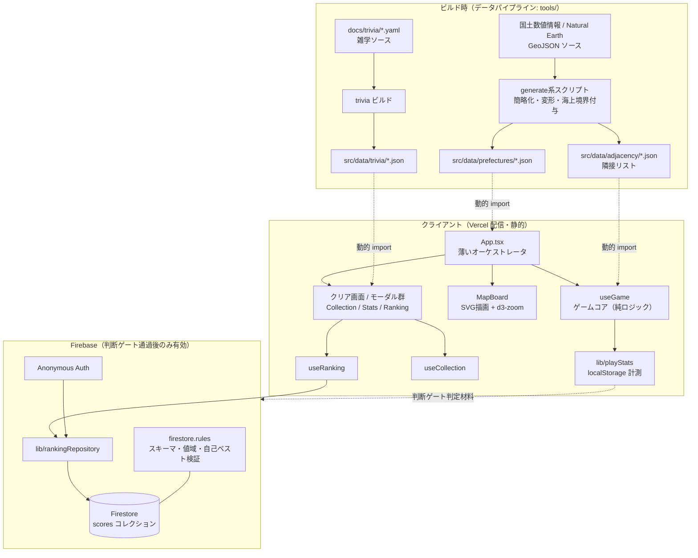

# 白地図マインスイーパ 次期メジャー開発 設計ドキュメント

対象リポジトリ: `hakuchizu-minesweeper`
作成日: 2026-07-07
ステータス: ドラフト（§0 の仮置き値の確定をもって正式版とする）

---

## 0. 本書の前提（最初に読むこと）

依頼時のプロジェクト概要（最終目標・リソース・期限）が未記入だったため、
リポジトリの実態（README の「今後の展望」、`docs/ranking-requirements.md`、
`docs/retention-metrics.md`、直近のコミット履歴）から以下を**仮置き**して本書を作成した。
値が確定したら本節を差し替え、§5（WBS）の見積りと §7（マイルストーン）を再計算すること。
それ以外の節（アーキテクチャ・リスク）は概要の変動に対して安定である。

| 項目 | 仮置き値 | 根拠 |
| --- | --- | --- |
| **最終目標** | ポートフォリオ試作を「一般公開に耐える v1.0」へ引き上げる。具体的には (a) リテンションループ（コレクション/統計/共有）の完成、(b) コンテンツ品質の底上げ（世界・市区町村マップのQA、雑学データ拡充）、(c) 判断ゲート通過時のグローバルランキング有効化 | README「今後の展望」＋ `docs/` の既存2文書がこの3点に収束している |
| **リソース** | 開発者1名（AIエージェント併用）、予算 0円（Vercel Hobby / Firebase Spark 無料枠のみ） | 既存要件定義書が無料枠前提で書かれている |
| **期限** | 着手から **12週間**（計測ゲートの2〜4週間を内包する最短の現実的期間） | `docs/retention-metrics.md` §4 の計測期間が下限を規定する |
| **市場** | 当面は日本市場に集中。英語圏は世界地図モードの完成後 | `docs/retention-metrics.md` §1 で確定済み |

**本書が引き継ぐ既決事項**（再議論しない）:

- USP は「本物の地図がそのまま盤面になるマインスイーパ」。地理学習は副次価値（`docs/retention-metrics.md` §1）
- ランキングは Phase 2 保留。判断ゲート（同 §4）を満たした場合のみ有効化
- バックエンド構成は Firebase (Firestore + Anonymous Auth) 採用で比較検討済み（`docs/ranking-requirements.md` §5）
- 新機能はゲーム盤面へのオーバーレイを避け、クリア画面・別画面に隔離する（同 §5 UX方針）

---

## 1. 現状分析（As-Is）

### 1.1 技術スタック

React 19 + TypeScript 6 + Vite 8 / D3 (`d3-geo`, `d3-zoom`) / Tailwind CSS 4 /
Firebase SDK 12（導入済み・環境変数未設定のため本番無効）/ Vercel（デプロイ）。

### 1.2 実装済み資産

| 領域 | 実体 | 状態 |
| --- | --- | --- |
| ゲームコア | `src/hooks/useGame.ts`（盤面生成・BFS開放・難易度4段階） | 安定。テスト用フック `window.__hakuchizuGame` あり |
| 地図描画 | `src/components/MapBoard.tsx`（SVG + d3-zoom、ズーム連動テキスト） | 安定。415行で肥大気味 |
| マップデータ | `src/data/prefectures/*.json`（47都道府県+地方+WORLD/USA/EUROPE、計26MB）+ `src/data/adjacency/*.json`（412KB） | 動的 `import()` でコード分割済み。品質は未QA（飛び地・海上境界の妥当性） |
| データ生成 | ルート直下の `generate*.mjs` / `*.py` / `scripts/` 群 | 動くが散在・手順書なし。再現性が個人の記憶に依存 |
| ローカル計測 | `src/lib/playStats.ts` + `usePlayStats.ts`（localStorage、外部送信なし） | 稼働中。`hakuchizuStats()` でJSON取得 |
| コレクション | `src/hooks/useCollection.ts` + `CollectionModal.tsx` | 実装済み（premortem 2周反映済み） |
| 共有 | `src/lib/share.ts`（絵文字シェアブロック） | 実装済み |
| ランキング | `src/lib/firebase.ts` / `rankingRepository.ts` / `useRanking.ts` / `RankingBoard.tsx` / `firestore.rules` | 疎結合で実装済み・**未有効化**（環境変数ゲート） |
| i18n | `src/i18n.ts`（ja/en） | 稼働中 |

### 1.3 ギャップ（本プロジェクトで埋めるもの）

1. **自動テストが1本もない**。`package.json` に test スクリプトすらなく、`jsdom` が
   devDependencies に居るだけ。ゲームロジック（地雷配置・BFS・クリア判定）は純関数的で
   テスト容易なのに、リグレッション検知が全て手動
2. **CI がない**。lint / build はローカル実行頼み。Vercel のビルド失敗が唯一のゲート
3. **`src/App.tsx` が417行**で、マップ読み込み・ゲーム進行・クリア画面・モーダル群の
   オーケストレーションを一手に担っており、機能追加のたびに衝突する
4. **データ生成パイプラインが文書化されていない**。マップ品質バグ（例: 岐阜の winding、
   東京の変形）の修正はアドホックスクリプトの再発見から始まる
5. **雑学（トリビア）データが i18n に直書き**で、拡充のスケール手段がない
6. **ランキング有効化前の宿題**が2件未消化: 匿名表示名の重複対応（`name#a1b2` 形式）と
   読み取り回数の実測ベース再見積もり（`docs/ranking-requirements.md` 冒頭に明記）

---

## 2. 全体アーキテクチャ設計（To-Be）

### 2.1 構成図



### 2.2 設計原則

1. **静的サイト + 任意バックエンド**: ゲーム本体は Firebase なしで完全動作する。
   バックエンド依存は `isRankingEnabled`（環境変数）の背後に隔離し続ける。
   これは既に実装されているパターンであり、今後の全機能もこれを踏襲する
2. **ゲームコアの純化**: `useGame` の盤面ロジック（地雷配置・近傍計算・BFS・判定）を
   React 非依存の純関数モジュール `src/lib/board.ts` に抽出し、フックは状態管理の殻にする。
   目的はテスト容易性と、将来のデイリーチャレンジ（シード固定盤面）への布石
3. **データはビルド時に確定**: マップ・隣接・雑学は全てビルド時生成のJSON。
   実行時のジオメトリ計算はしない（現行方針の明文化）
4. **App.tsx の分割**: 画面状態機械（メニュー→プレイ→クリア）を `useAppState` に、
   マップ読み込みを `useMapLoader` に抽出し、App.tsx は 150行以下の合成層にする
5. **盤面UXへの不可侵**: リテンション系機能はクリア画面と独立モーダルにのみ追加する
   （既決事項の継承）

### 2.3 ディレクトリ構造（To-Be）

```
tools/                       # ルート散在の generate*/check*/analyze* を集約
  pipeline/                  #   ソース取得→簡略化→隣接生成の正規パイプライン
  README.md                  #   再現手順（どのソースから何が生成されるか）
src/
  lib/
    board.ts                 # ★新規: ゲームコア純関数（useGame から抽出）
    playStats.ts / share.ts / firebase.ts / rankingRepository.ts
  hooks/
    useGame.ts               # board.ts を使う状態管理の殻に縮小
    useMapLoader.ts          # ★新規: 動的 import とローディング状態
    useAppState.ts           # ★新規: 画面遷移の状態機械
    useCollection.ts / usePlayStats.ts / useRanking.ts
  data/
    trivia/                  # ★新規: 雑学JSON（i18n から分離、マップ別に動的 import）
    prefectures/ adjacency/ prefList.ts
  components/                # 現行のまま（MapBoard は描画専任を維持）
tests/                       # ★新規: Vitest（board / playStats / collection / share）
.github/workflows/ci.yml     # ★新規: lint + typecheck + test + build
docs/
  major-project-design.md    # 本書
  ranking-requirements.md / retention-metrics.md
```

### 2.4 データモデル（差分のみ）

- **Firestore `scores`**: `docs/ranking-requirements.md` §3 を変更なしで踏襲。
  有効化前に表示名を `name` + UID下4桁の合成表示（`name#a1b2`）へ変更（表示層のみ、スキーマ不変）
- **雑学 `src/data/trivia/{mapId}.json`**: `{ code: string, ja: string, en?: string }[]`。
  人気マップ（playStats の topMaps 実測）から優先作成し、全網羅を目標にしない（既決事項）
- **localStorage**: `hakuchizu-play-stats-v1` は現行スキーマ凍結。変更が必要になったら
  `version` フィールドでマイグレーション（破壊的変更は計測の連続性を壊すため原則禁止）

---

## 3. 非機能要件

| # | 分類 | 要件 | 検証方法 |
| --- | --- | --- | --- |
| N-1 | 性能 | 初期表示（メニュー到達）: 4G相当で 3秒以内。マップデータは選択後に動的ロード（現行方式維持） | Lighthouse / スロットリング実測 |
| N-2 | 性能 | 最大盤面（北海道194市町村・WORLD）で開放連鎖時もフレーム落ちなし（操作ブロック 100ms 未満） | 実機（低スペックAndroid）での体感QA + Performance プロファイル |
| N-3 | 性能 | ビルド後の初期チャンク（マップデータ除く）500KB gzip 以内 | `vite build` のレポートをCIで監視 |
| N-4 | コスト | 恒常コスト 0円。Firestore は読み5万/日・書き2万/日の無料枠内（閲覧≈2,300回/日相当）。超過予兆で上位N件の1ドキュメント非正規化へ移行 | Firebase コンソールの使用量アラート（50%閾値） |
| N-5 | セキュリティ | Firestore ルールで「本人ドキュメントのみ・スキーマ/値域(1〜86400秒)検証・自己ベスト更新のみ・delete不可」を強制。ルールのユニットテスト（emulator）を有効化前に必須 | `firebase emulators` + ルールテスト |
| N-6 | プライバシー | 収集は匿名UIDとニックネームのみ。ローカル計測（playStats）は外部送信しない。ニックネーム入力欄に個人情報を入れない旨の注記 | コードレビュー + UI確認 |
| N-7 | 互換性 | iOS Safari / Android Chrome の直近2メジャー + PC Chrome/Edge/Firefox。タッチ操作（タップ/ロングタップ/ピンチ/ドラッグ）の競合なし | 実機マトリクスQA（リリース前チェックリスト化） |
| N-8 | 可用性 | Firebase 障害・未設定時もゲーム本体は無影響（ランキングUI非表示にフォールバック） | 環境変数を外した状態のE2E確認 |
| N-9 | i18n | 全ユーザー向け文言は `src/i18n.ts` 経由。雑学は ja 必須・en 任意（en 欠落時は非表示、フォールバックで英文を出さない） | lint 的レビュー |
| N-10 | 保守性 | 単一ファイル400行超を新規に作らない。ゲームコアのテストカバレッジ: 分岐網羅で主要ロジック100%（board.ts） | CI + カバレッジレポート |
| N-11 | 観測性 | Vercel Analytics（無料枠）でトラフィック、playStats でゲーム内行動。ランキング有効化後は Firestore 使用量を週次確認 | 運用チェックリスト |
| N-12 | データ品質 | 全マップで「隣接リストとジオメトリの整合」「孤立地域（隣接0）の意図性」を機械検証するスクリプトを持つ | `tools/pipeline/validate.mjs`（新規）をCIに組込み |

---

## 4. スコープ定義

### 4.1 スコープ内（Phase 単位）

- **P0 基盤**: テスト・CI・リファクタリング・データパイプライン整備
- **P1 リテンションループ完成**: コレクション/統計/共有の磨き込み + 雑学データ基盤 + 計測運用
- **P2 コンテンツ品質**: 世界・地方・市区町村マップのQAと修正、人気マップへの雑学追加
- **P3 ランキング有効化**（条件付き）: 判断ゲート通過時のみ。Firebase 本番設定、宿題2件の消化、実機QA
- **P4 リリースと計測**: v1.0 タグ、README 更新、計測レビュー

### 4.2 スコープ外（明示的に今回やらない）

- ネイティブアプリ化 / PWA のオフライン完全対応
- サーバー検証によるチート完全防止（Cloud Functions 有料化を伴うため。外れ値フィルタで代替）
- 歴史的マップ・デイリーチャレンジ（board.ts 抽出で布石のみ打つ）
- 英語圏マーケティング（世界地図モードの完成度向上まで凍結、既決事項）
- アカウント機能（メール/SNSログイン）。匿名認証のまま

---

## 5. WBS（実装タスクの極小分解）とクリティカルパス

見積りは1人日=実働6h、担当1名。**計12週のうち実装は約9週分**とし、
バッファ約3週（25%）を Phase 末尾ではなくプロジェクト末尾に一括で持つ。

### Phase 0: 基盤整備（想定 1.5週）

| ID | タスク | 見積 | 依存 | 完了条件 |
| --- | --- | --- | --- | --- |
| P0-1 | Vitest 導入（`npm t` 動作、jsdom 環境、CI用レポータ） | 0.5d | — | 空テストがパスする |
| P0-2 | `useGame` から純関数 `src/lib/board.ts` を抽出（配置/近傍/BFS/判定） | 1d | P0-1 | useGame の外部仕様不変で全難易度が手動プレイ可 |
| P0-3 | board.ts のユニットテスト（初手安全性、地雷数、BFS連鎖、クリア/敗北判定、フラグ） | 1d | P0-2 | 主要分岐100%、既知の隣接データでの回帰ケース含む |
| P0-4 | playStats / useCollection / share のユニットテスト | 1d | P0-1 | localStorage モックで記録・集計・絵文字ブロックを検証 |
| P0-5 | GitHub Actions CI（lint + `tsc -b` + test + build、チャンクサイズ監視） | 0.5d | P0-1 | main と PR で必須チェック化 |
| P0-6 | App.tsx 分割（`useMapLoader` / `useAppState` 抽出、App.tsx ≤150行） | 1.5d | P0-3 | 全画面遷移が手動QAで従来同等 |
| P0-7 | データ生成スクリプトを `tools/` へ集約 + `tools/README.md`（再現手順） | 1d | — | クリーン環境で1マップを再生成できる手順書 |
| P0-8 | データ検証スクリプト `tools/pipeline/validate.mjs`（隣接↔ジオメトリ整合、孤立検出）+ CI組込み | 1d | P0-7 | 全既存マップの検証結果一覧が出る（既知の意図的孤立は許可リスト） |

### Phase 1: リテンションループ完成（想定 2週）— **計測ウィンドウの起点**

| ID | タスク | 見積 | 依存 | 完了条件 |
| --- | --- | --- | --- | --- |
| P1-1 | 雑学データ基盤: i18n から `src/data/trivia/` へ分離、マップ別動的 import | 1d | P0-6 | 既存雑学が新経路で表示される |
| P1-2 | 雑学コンテンツ第1弾（topMaps 上位5マップ × 主要地域） | 2d | P1-1 | 対象マップの開放時表示率（雑学あり地域率）50%以上 |
| P1-3 | コレクション画面の仕上げ（未開放地域のヒント表示、達成演出） | 1.5d | P0-6 | 実機で違和感のない導線（メニュー→コレクション→該当マップ起動） |
| P1-4 | 統計モーダルの仕上げ（継続日数・クリア率の見せ方） | 1d | P0-6 | playStats の主要4指標が閲覧できる |
| P1-5 | 絵文字シェアの実機QA（LINE/X 貼り付け崩れ確認）と修正 | 0.5d | — | 主要2アプリで表示崩れなし |
| P1-6 | **計測運用の開始**: テスター5名以上への配布、`hakuchizuStats()` JSON回収手順の確立 | 0.5d | P1-2〜P1-5 | テスター全員が初回プレイ完了、回収方法合意 |
| P1-7 | デプロイ（計測開始版）+ Vercel Analytics 確認 | 0.5d | P1-6 | 本番反映・計測稼働 |

> **P1-7 完了時点で計測ウィンドウ（2〜4週間）が開く。** ここが本プロジェクト最大の
> スケジュール制約であり、P1 の遅延は全体期限に1:1で波及する（§5.5 参照）。

### Phase 2: コンテンツ品質（想定 2.5週）— 計測ウィンドウと並行実行

| ID | タスク | 見積 | 依存 | 完了条件 |
| --- | --- | --- | --- | --- |
| P2-1 | 世界地図QA: P0-8 の検証結果に基づく隣接・海上境界の修正 | 2d | P0-8 | 検証スクリプト全パス + 手動プレイで理不尽な運ゲーなし |
| P2-2 | 市区町村マップQA: 大規模盤面（北海道等）の描画・性能・隣接確認 | 2d | P0-8 | N-2 を満たす。政令市の区の扱いを確定 |
| P2-3 | USA / EUROPE マップの同上QA | 1.5d | P2-1 | 検証全パス |
| P2-4 | マップ修正のパイプライン反映（手パッチ禁止、tools/ 経由で再生成） | 1d | P2-1〜P2-3 | 再生成で同一成果物が得られる |
| P2-5 | 雑学コンテンツ第2弾（topMaps 実測に基づく次点マップ） | 1.5d | P1-6 の初期データ | 実測人気マップの雑学カバー |
| P2-6 | 難易度バランス調整（クリア率30〜70%帯へ、計測データ参照） | 1d | 計測2週目以降 | 全体クリア率が適正帯に入る見込みの調整をデプロイ |

### 判断ゲート G1（計測開始から2〜4週後）

`docs/retention-metrics.md` §4 の3条件（再訪の実在 / タイム意識の実在 / クリア率適正帯）を
評価し、**Phase 3 実施 or 代替パス**を決定する。評価会の実施自体をタスク化する（0.5d）。

- **ゲート通過** → Phase 3 へ
- **不通過** → Phase 3 を破棄し、代替パス P3'（学習進捗可視化の深掘り + 人気マップへの
  コンテンツ追加、2週相当）へ差し替え。WBS上の後続（P4）は不変

### Phase 3: ランキング有効化（想定 1.5週・**条件付き**）

| ID | タスク | 見積 | 依存 | 完了条件 |
| --- | --- | --- | --- | --- |
| P3-1 | 表示名重複対応（`name#UID下4桁` 表示、表示層のみ） | 0.5d | G1通過 | 同名2ユーザーが識別できる |
| P3-2 | 読み取り回数の再見積もり（計測実測のクリア数×閲覧率から算出、N-4 判定） | 0.5d | G1通過 | 無料枠内の根拠数値を本書に追記 |
| P3-3 | Firestore ルールのエミュレータテスト（create/update/delete、値域、他人ドキュメント拒否） | 1d | P3-1 | ルールテスト全パス（N-5） |
| P3-4 | Firebase 本番プロジェクト設定（Auth匿名、ルール公開、複合インデックス、env設定） | 0.5d | P3-3 | ステージング（Vercel Preview）で送信・閲覧・順位表示が動く |
| P3-5 | クリア画面への `RankingBoard` 組込み + 実機QA（スマホ入力体験） | 1d | P3-4 | iOS/Android 実機でニックネーム入力→送信→順位表示 |
| P3-6 | 使用量アラート設定（無料枠50%）+ 非正規化移行の発火条件文書化 | 0.5d | P3-4 | アラート受信テスト済み |
| P3-7 | 段階公開（デプロイ→初週は使用量を毎日確認） | 0.5d | P3-5, P3-6 | 本番有効化 |

### Phase 4: リリース（想定 1週）

| ID | タスク | 見積 | 依存 | 完了条件 |
| --- | --- | --- | --- | --- |
| P4-1 | 互換性マトリクスQA（N-7 のブラウザ×操作の総当たりチェックリスト） | 1d | P2, P3(or P3') | チェックリスト全消化 |
| P4-2 | README・スクリーンショット更新、v1.0 タグ | 0.5d | P4-1 | 公開情報が実態と一致 |
| P4-3 | 計測レビューと次期計画（v1.1 テーマ決定: デイリーチャレンジ等） | 0.5d | P4-2 | 次期テーマの1枚メモ |

### 5.5 クリティカルパス

```
P0-1 → P0-2 → P0-3 → P0-6 → P1-1 → P1-2 → P1-6 → P1-7
  →【計測ウィンドウ 2〜4週（暦時間・短縮不可）】→ G1 → P3-1..7（or P3'）→ P4-1 → P4-2
```

- **支配的制約は暦時間**: 計測ウィンドウは人手を足しても短縮できない
  （`docs/retention-metrics.md` §4 で最低2週間と規定）。したがって
  **P1-7（計測開始版デプロイ）をいかに早く出すかが全体期限を決める**。
  P0 のうち計測開始に不要なもの（P0-7, P0-8 のデータパイプライン系）は
  クリティカルパス外なので、P1 と並行に回してよい
- **Phase 2 は全体が非クリティカル**（計測ウィンドウ内に収まる限り）。
  遅延吸収のバッファ置き場として機能する
- **G1 の評価遅延はそのまま納期遅延**。評価会は計測開始日+14日に事前予約しておく
- フロート（余裕）が最も小さいタスク: P1-2（雑学第1弾）。コンテンツ作成は
  機械的に加速しにくいため、P1-1 完了を待たず雑学の**原稿執筆だけ先行着手**する

### 5.6 工数サマリ

| Phase | 見積 | 備考 |
| --- | --- | --- |
| P0 | 7.5d | |
| P1 | 7d | 完了で計測開始 |
| P2 | 9d | 計測ウィンドウと並行 |
| G1 | 0.5d | 暦上は計測開始+2〜4週 |
| P3 (or P3') | 4.5d (or 10d) | 条件分岐 |
| P4 | 2d | |
| **合計** | **30.5〜36d ≒ 6〜7.5週** | 12週期限に対しバッファ 4.5〜6週（暦制約の計測2〜4週を含む） |

---

## 6. 潜在的リスク・未確定要素と対応策

### 6.1 リスク台帳

影響度: 高=期限またはプロダクト価値を直撃 / 中=1週間以内の遅延・部分的劣化 / 低=軽微

| ID | リスク | 確率 | 影響 | 対応策（予防/発生時） |
| --- | --- | --- | --- | --- |
| R-1 | **テスターが集まらない・データが回収できない**（判断ゲートが評価不能になる） | 中 | 高 | 予防: P1-6 で配布前に5名の内諾を取る。回収は「コンソールでコマンド実行」の負荷が高いので、統計モーダルに「計測データをコピー」ボタンを追加する（0.5d、P1-4 に含める）。発生時: ゲート評価を「テスター定性ヒアリング+Vercel Analytics の再訪率」で代替し、その旨を本書に追記 |
| R-2 | **判断ゲート不通過**（ランキングが正当化できない） | 中 | 中 | これは失敗ではなく設計済みの分岐。P3' へ差し替え（§5 G1）。Firebase 実装は疎結合のまま温存し、破棄しない |
| R-3 | **useGame→board.ts 抽出でのリグレッション**（初手安全性・BFS の微妙な挙動差） | 中 | 中 | 予防: 抽出**前に** `window.__hakuchizuGame` を使った現行挙動の特性テスト（characterization test）を書き、抽出後に同一パスを保証。P0-3 に含める |
| R-4 | **市区町村マップの性能問題**（低スペック端末で大規模盤面がフレーム落ち） | 中 | 中 | 予防: P2-2 で最悪ケース（北海道194、WORLD）を最初に測る。発生時: SVG パス簡略化の強度を上げる（tools/ パイプラインの許容誤差パラメータ）、テキスト描画の間引き。それでも不足なら該当マップに「大型マップ」警告を付けて出荷は止めない |
| R-5 | **Firestore 無料枠超過**（バズ等での急増） | 低 | 中 | 予防: 使用量50%アラート（P3-6）+「クリア画面でのみ取得・ポーリングなし」の現行方針維持。発生時: 上位N件の1ドキュメント非正規化（設計済み、`docs/ranking-requirements.md` §2）へ移行。読み取りが1/20になる |
| R-6 | **チート記録によるランキング汚染** | 中 | 低〜中 | ルール検証（値域・自己ベストのみ）は実装済み。追加で「理論最短未満の外れ値を表示時にフィルタ」する閾値をマップ別に持つ（P3-5 に含める）。完全防止は追わない（既決事項） |
| R-7 | **地図データの権利・出典表記漏れ** | 低 | 高 | 未確定要素 U-2 として先行確認（下表）。出典（国土数値情報 / Natural Earth 等）のクレジットを AboutModal に明記するタスクを P4-2 に含める |
| R-8 | **1人開発の稼働変動**（本業・体調で週あたり稼働が読めない） | 高 | 中 | バッファを末尾一括4.5週確保済み。クリティカルパス上のタスク（P0-1〜P1-7）を最優先し、P2 を可変長の調整弁にする。週次で「計測開始日」だけを死守指標として自己レビュー |
| R-9 | **雑学コンテンツの品質・事実誤認**（知育アプリとして信頼を損なう） | 中 | 中 | 原稿に出典URLを必須フィールドとして持たせ（`trivia` スキーマに `source` 追加）、公開前に一括ファクトチェックの目視パスを設ける（P1-2/P2-5 の完了条件に含める） |
| R-10 | **Vercel Hobby の商用利用制限への抵触** | 低 | 中 | 現状は非商用ポートフォリオで問題なし。収益化（広告等）を検討する場合は Pro 移行が前提になることを未確定要素 U-4 に記録し、本プロジェクトでは収益化しない |
| R-11 | **依存の最新版追従リスク**（React 19 / Vite 8 / Tailwind 4 の破壊的変更・エコシステム未成熟） | 低 | 低 | 本プロジェクト中はメジャーアップデートを凍結（`package-lock.json` 固定）。CI 導入（P0-5）でアップデート時の検知面を先に作る |

### 6.2 未確定要素（Unknowns）

| ID | 未確定要素 | 影響する箇所 | 解消期限 | 解消方法 |
| --- | --- | --- | --- | --- |
| U-1 | **プロジェクト概要の正式値**（目標・リソース・期限） | §0、§5 の全見積り | 着手前 | 依頼者が §0 の表を確定させる。期限が12週より短い場合は P2 を削る（P2-3, P2-5 が第一候補） |
| U-2 | **地図データソースの利用条件**（再配布・改変の可否、出典表記の要件） | R-7、公開可否 | P0 中 | `tools/README.md` 作成時に各ソースのライセンスを確認・記録する |
| U-3 | **政令指定都市の区の扱い**（市単位に統合するか、区を独立マスにするか。盤面サイズと隣接データに影響） | P2-2 | P2-2 着手時 | 現行データの実態を確認し、プレイ感（1マスの大きさの均質性）で決定。決定を本書に追記 |
| U-4 | **将来の収益化方針**（広告/買い切り/なし） | R-10、Vercel プラン | 本プロジェクト外 | v1.1 計画（P4-3）の議題とする。今回は「なし」で確定 |
| U-5 | **テスター向け配布とストア展開の要否**（PWA化の優先度） | スコープ §4.2 | G1 評価時 | 計測でモバイル比率が支配的なら v1.1 で PWA を再検討 |
| U-6 | **世界地図モードの英語圏展開判断** | i18n 投資量（N-9） | v1.1 以降 | 既決事項どおり凍結。世界マップQA（P2-1）完了後に再評価 |

### 6.3 前提が崩れた場合の縮退計画

期限が半分（6週）になった場合の最小構成:
**P0-1〜P0-6（基盤コア）→ P1（全部）→ 計測2週 → G1 → P4**。
P2 と P3 を全面的に次期へ送る。この場合でも「計測に基づく判断ゲート」という
プロジェクトの背骨は維持される。

---

## 7. マイルストーンと判断ゲート

| 週 | マイルストーン | 判定基準 |
| --- | --- | --- |
| W2 | M1: 基盤完了 | CI 必須チェック稼働、board.ts テスト100%、App.tsx ≤150行 |
| W4 | M2: **計測開始版デプロイ**（クリティカル） | P1 全完了、テスター5名がプレイ開始 |
| W6〜8 | G1: 判断ゲート評価 | `docs/retention-metrics.md` §4 の3条件で Phase 3 or P3' を決定 |
| W8〜10 | M3: ランキング有効化 or 代替機能完了 | P3 全完了（ルールテスト・実機QA・アラート込み）or P3' 完了 |
| W10〜12 | M4: v1.0 リリース | 互換性マトリクス全消化、README 更新、タグ付け |

## 8. 完了の定義（Definition of Done）

1. §3 の非機能要件 N-1〜N-12 が全て検証済み（各行の「検証方法」を実施した記録がある）
2. §5 の WBS タスクが完了 or 明示的にスコープアウトの判断記録がある
3. 判断ゲート G1 の評価結果と根拠データが `docs/` に記録されている
4. `main` が CI グリーンで、クリーン環境から `npm ci && npm run build && npm t` が通る
5. 本書の §0 仮置き値・U-1〜U-3 が確定値で更新されている
